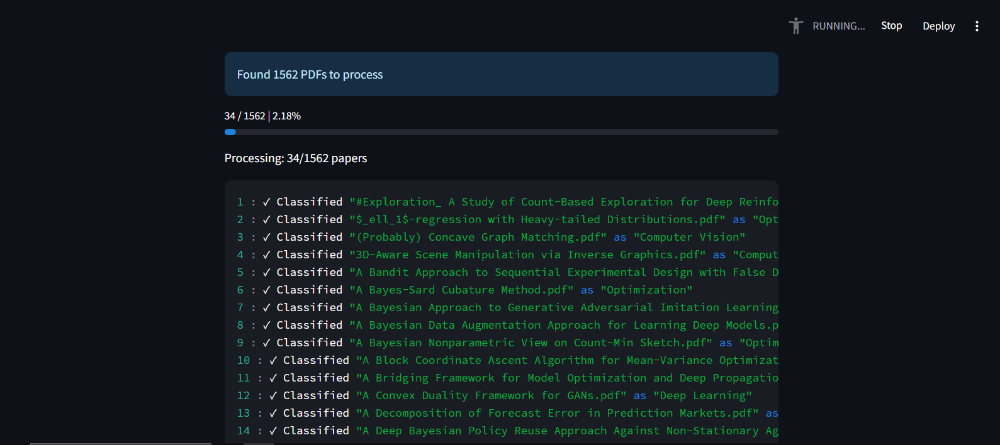
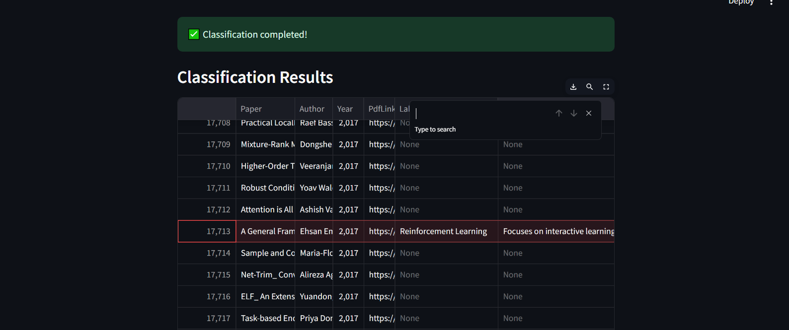

# Research Paper Classifier with Gemini AI

**Automated AI-Powered Research Paper Categorization System**

 *Replace with actual banner image*

> ## Overview

The Research Paper Classifier is a sophisticated Streamlit application that leverages Google's Gemini AI to automatically categorize research papers into predefined domains. Designed for researchers, academicians, and AI enthusiasts, this tool streamlines paper organization and metadata management.

> ## Key Features

- **🤖 Gemini AI Integration**: Utilizes state-of-the-art LLM capabilities for accurate document classification
- **📁 Batch Processing**: Handles multiple PDF files simultaneously with configurable input directories
- **⚙️ Customizable Categories**: Supports both default and user-defined classification categories
- **📊 CSV Metadata Management**: Maintains structured records of classifications with reasoning
- **📈 Real-Time Progress Tracking**: Interactive progress bar and detailed processing logs
- **🔒 Secure API Handling**: Safe management of Gemini API credentials

> ## Installation

1. **Clone Repository**:
   ```bash
   git clone https://github.com/Anas-Altaf/Doc-Annotator_py.git
   cd Doc-Annotator_py
   ```

2. **Create Virtual Environment**:
   ```bash
   python -m venv .venv
   source .venv/bin/activate  # Windows: .venv\Scripts\activate
   ```

3. **Install Dependencies**:
   ```bash
   pip install streamlit pandas google-genai python-dotenv
   ```

> ## Configuration

1. **Obtain Gemini API Key**:
    - Visit [Google AI Studio](https://aistudio.google.com/)
    - Create API key and keep it secure

2. **Directory Setup**:
   ```bash
   mkdir -p downloaded_papers metadata
   ```

> ## Usage

1. **Launch Application**:
   ```bash
   streamlit run app.py
   ```

2. **Interface Guide**:
    - **PDF Directory**: Path containing research papers (default: `./downloaded_papers`)
    - **CSV Output Path**: Metadata storage location (default: `./metadata/papers_metadata.csv`)
    - **API Key**: Your Gemini API key (masked input)
    - **Custom Categories**: Optional user-defined classification labels

3. **Classification Process**:
    - Click "Start Classification" to initiate processing
    - Monitor real-time progress in the dashboard
    - View results in interactive DataFrame display
    - Access historical data through generated CSV files

> ## Screenshots

  
*Main application interface with configuration options*

  
*Real-time progress tracking during classification*

  
*Final classification results with export options*

> ## Architecture

```mermaid
graph TD
    A[User Interface] --> B[PDF Directory]
    A --> C[Gemini API]
    B --> D[PDF Processor]
    C --> E[AI Classification]
    D --> E
    E --> F[CSV Metadata]
    F --> G[Results Visualization]
```

> ## Troubleshooting

**Common Issues**:
- `FileNotFoundError`: Ensure directories exist before processing
- `API Authentication Error`: Verify correct Gemini API key
- `Invalid Response Format`: Check PDF readability and AI response parsing

**Debugging**:
```bash
# Enable debug logging
STREAMLIT_DEBUG=1 streamlit run app.py
```

> ## Performance

| Metric    | Specification |
|-----------|-------------|
| Avg Speed |5-100 pdfs/minute |
| Maximum File Size | 50MB per PDF |
| Supported Languages | English technical text |
| Accuracy Range | 99-100% (varies by domain) |

> ## Contributing

We welcome contributions! Please follow these steps:
1. Fork the repository
2. Create feature branch (`git checkout -b feature/improvement`)
3. Commit changes (`git commit -m 'Add amazing feature'`)
4. Push to branch (`git push origin feature/improvement`)
5. Open Pull Request

> ## License

Distributed under MIT License. See `LICENSE` for more information.